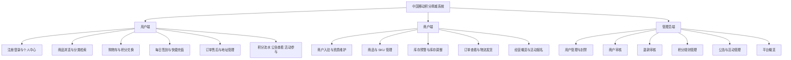
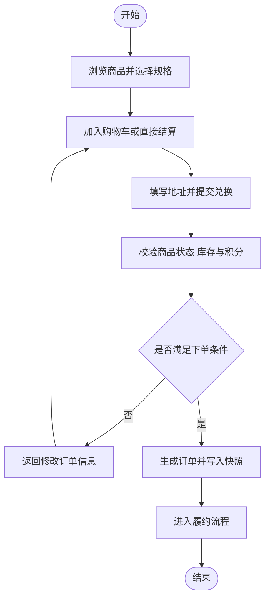
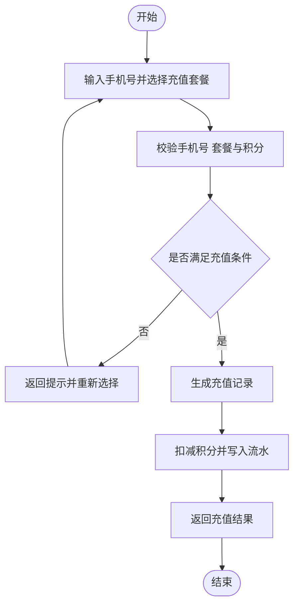
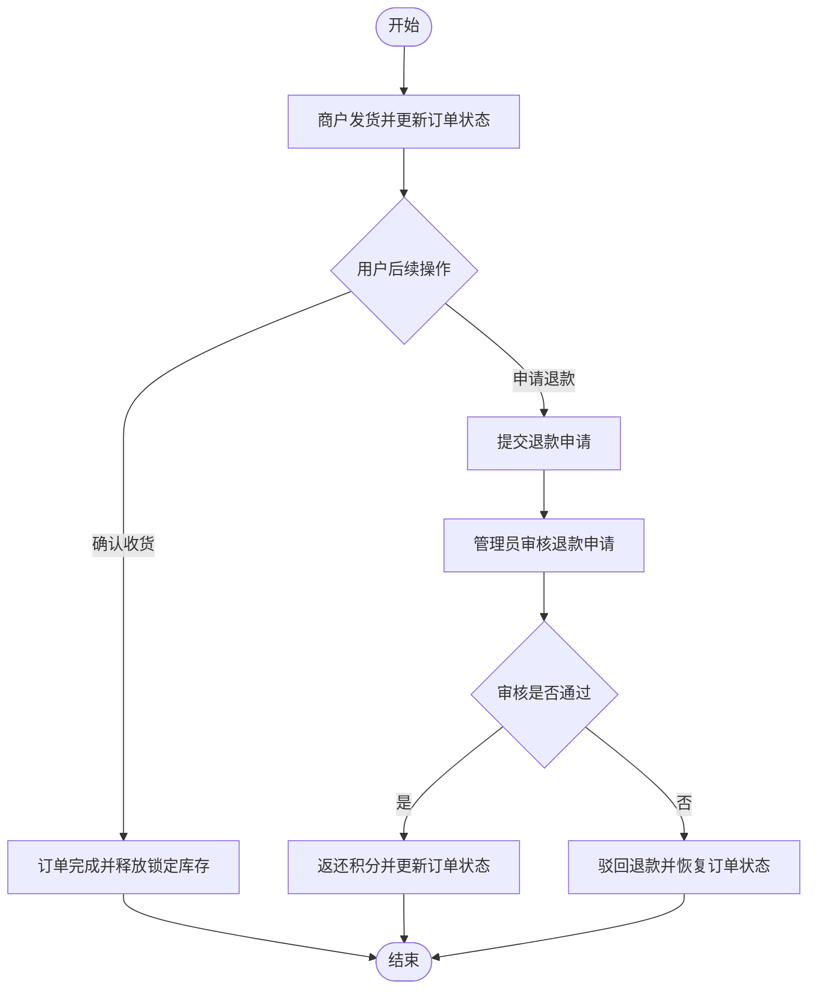
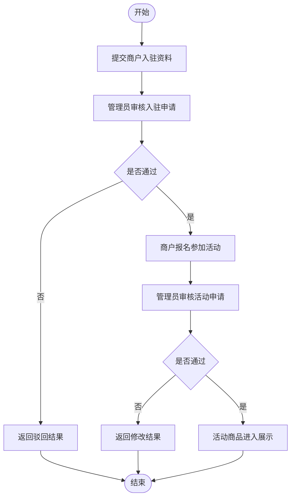
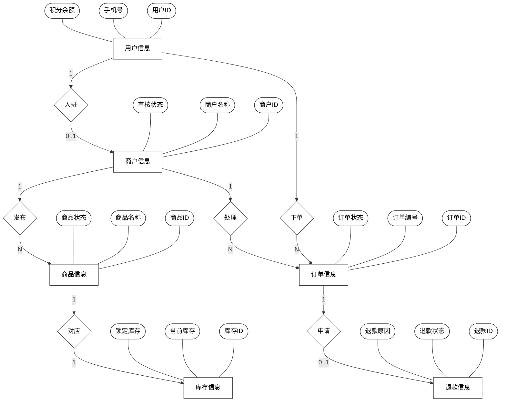

编 号 __________

# 本科生毕业设计

# 中国移动积分商城系统的设计与实现

# Design and Implementation of China Mobile Points Mall System

学 生 姓 名 祝小雨

专 业 计算机科学与技术

学 号 2241330

指 导 教 师 白宝兴

学 院 信息工程学院

2026 年 6 月

## 学位论文原创性声明

本人郑重声明：所呈交的论文是本人在指导教师指导下独立完成的研究成果。除文中已经明确标注引用的内容外，本论文不包含任何其他个人或集体已经发表或撰写过的成果。对本文的研究工作做出重要贡献的个人和集体，均已在文中以明确方式标明。本人完全意识到本声明的法律后果由本人承担。

作者签名：______________

年 月 日

## 学位论文版权使用授权书

本人完全了解学校有关学位论文保存、使用和管理的规定，同意学校保留并向有关部门送交论文的复印件和电子版，允许论文被查阅和借阅；同意学校将论文的全部或部分内容编入有关数据库进行检索，可以采用影印、缩印或扫描等复制手段保存和汇编本论文。

作者签名：______________

年 月 日

导师签名：______________

年 月 日

## 摘 要

围绕中国移动积分商城场景，本文按照“需求分析、总体设计、系统实现、场景测试”的技术路线，设计并实现了一套面向用户、商户和管理员三类角色的积分商城系统。系统采用前后端分离架构，后端基于 FastAPI、SQLAlchemy 与 MySQL，前端基于 Vue 3、Pinia、Vite 与 Element Plus，并以 Redis 提供认证扩展支撑。系统实现了积分发放、签到、商品兑换、购物车结算、快捷充值、订单履约、退款审核、商户管理和运营配置等功能，并通过数据库事务、订单快照和锁定库存机制保证积分、订单与库存状态一致。测试结果表明，系统能够稳定支撑主要业务流程，具备较好的可用性、可维护性和教学示范价值。

关键词：中国移动积分商城；积分运营；订单履约；FastAPI；Vue 3

## ABSTRACT

Focusing on the business scenario of China Mobile Points Mall, this paper follows the route of requirement analysis, overall design, system implementation, and scenario-based testing to build a points mall system for users, merchants, and administrators. The system adopts a front-end and back-end separated architecture. The back end is built with FastAPI, SQLAlchemy, and MySQL, while the front end uses Vue 3, Pinia, Vite, and Element Plus, with Redis serving as an authentication support component.

The system covers points issuance, daily check-in, product redemption, shopping cart settlement, quick recharge, order fulfillment, refund review, merchant management, and operation configuration. Database transactions, order snapshots, and locked inventory are used together to keep points, orders, and inventory states consistent.

Test results show that the system can stably support major business processes and has good usability, maintainability, and teaching value.

Keywords: Mobile Points Mall; Points Operations; Fulfillment; FastAPI; Vue 3

## 目 录

绪论

第一章 系统概述

第二章 系统相关技术概述

第三章 可行性分析和需求分析

第四章 系统总体设计

第五章 系统实现

第六章 系统测试

结论

参考文献

致谢

注：当前为 Markdown 论文草稿，导出为 Word 后需按学校模板更新目录页码、调整二级和三级标题缩进，并将图题、表题统一置于图表下方。

# 绪 论

伴随移动互联网基础设施持续完善以及平台化运营理念不断深化，通信运营商的客户经营模式正在由“规模扩张”转向“价值经营”。在这一转型过程中，积分不再只是营销活动中的附加奖励，而逐渐成为用于识别活跃用户、引导消费路径、沉淀平台黏性和连接多元权益供给的重要工具。对于运营商而言，积分体系既面向前台用户体验，也关联后台商品供给、规则配置、审核治理与订单履约，因此其背后实际对应的是一个具有多主体协同特征的信息系统问题，而非单纯的积分发放功能。

与普通电商平台相比，积分商城的业务重点并不完全落在现金交易和价格竞争上，而在于如何将“积分资产”转化为用户可感知、可使用、可追踪的权益价值。系统如果只能完成积分累积，而缺乏稳定的兑换链路、明确的库存约束、可解释的订单状态和有效的运营治理机制，积分就难以真正成为提升用户忠诚度和平台价值的抓手。因此，积分商城系统设计的关键不只是页面展示是否完整，更在于角色边界是否清楚、关键状态是否闭环、数据流转是否可验证。

基于上述认识，本文以中国移动积分商城为研究对象，围绕“业务链路完整、三端协同清晰、关键数据一致、系统实现可落地”这一目标展开研究。研究方法上，本文综合采用文献梳理、业务场景抽象、角色需求分析、系统分层设计、数据库建模与典型场景测试等手段，对积分商城系统进行系统化设计与工程实现。相较于一味追求复杂微服务架构的方案，本文更强调在教学型项目周期和部署条件下，以适度复杂度实现真实业务闭环，从而增强方案的可开发性、可演示性和可验证性。

全文结构安排如下：第一章分析研究背景、国内外研究现状、研究意义与主要研究内容；第二章介绍系统采用的关键技术，并论证其适用性；第三章从技术、经济、操作与安全等方面进行可行性分析，并提出系统功能与非功能需求；第四章完成总体架构、功能模块、业务流程与数据库设计；第五章结合实际代码说明各核心模块的实现机制；第六章通过典型测试场景验证系统功能、权限和一致性；最后对全文工作进行总结，并讨论后续可扩展方向。

# 第一章 系统概述

## 1.1 研究背景

近年来，会员积分体系已在通信、金融、电商、零售和生活服务等领域得到广泛应用。企业借助积分机制将用户行为与平台激励联系起来，使“注册、签到、消费、参与活动、评价反馈”等行为都能够被量化并映射为可运营资产。对于通信运营商而言，积分体系的重要性尤为突出。一方面，运营商拥有庞大的用户规模和多样的业务触点，天然具备开展积分运营的基础；另一方面，用户对积分价值的直观感受往往取决于权益兑换链路是否顺畅、商品供给是否稳定以及售后处理是否透明。如果这些环节衔接不良，积分体系就会停留在形式层面，难以转化为真正的用户黏性和平台价值。

从业务现实看，传统积分平台通常存在四类突出问题。其一，用户侧功能常聚焦于积分查询，而对商品检索、兑换决策、订单跟踪和售后反馈支持不足，导致积分“可见而难用”。其二，商户侧的商品、规格和库存管理能力较弱，平台供给端缺乏连续性与可视化支持。其三，管理员侧缺少统一的规则配置、商户审核和活动运营工具，运营动作过于依赖人工处理。其四，在高频积分兑换场景下，如果订单创建、积分扣减与库存变化缺少严格约束，就容易产生超卖、重复扣分或状态不一致等问题。

因此，面向运营商积分场景构建一个兼顾业务真实性与工程可实现性的积分商城系统，具有明确的现实意义。该系统不仅需要覆盖用户端、商户端和管理员端三类主体的典型业务，还应能够对关键数据关系进行有效控制，使积分获取、积分消费、订单履约和平台治理之间形成可持续运行的业务闭环。

## 1.2 研究现状

### 1.2.1 国外研究现状

国外关于会员积分与忠诚度平台的研究较早从用户留存和权益价值感知角度展开，相关综述指出积分机制正在由单一促销工具转向持续性的用户关系运营手段[1]。

在零售与数字服务场景中，研究者进一步强调积分规则、用户画像和推荐策略之间的协同关系，认为权益配置效率会直接影响平台活跃度与复购表现[2]。

在系统工程层面，近年的研究开始关注平台弹性治理、云边协同和服务解耦问题，说明大规模积分平台已经不再只是业务应用问题，同时也是复杂系统治理问题[3]。

但这类研究多面向商业化大系统，其部署复杂度和运维成本相对较高。对于毕业设计或教学型项目而言，若直接照搬此类方案，容易出现架构设计过重、实现重点偏移和验证成本上升等问题。

### 1.2.2 国内研究现状

国内关于积分商城的研究更多与行业业务改造和平台运营实践相关，银行积分商城的设计研究表明，积分平台正逐步从单纯兑换入口转向覆盖规则配置、页面体验和运营闭环的综合系统[4]。

公共文化服务领域的实践研究也说明，积分商城能够通过权益兑换和活动联动提升用户参与度，但前提是兑换路径和结果反馈足够清晰[5]。

在个性化运营方面，有研究从营销推荐角度讨论了数据分析与权益配置的联动方式，为积分商城提升活跃度提供了方法参考[6]。

在技术落地方面，现有成果开始采用分层架构和微服务思想改造行业平台，这为多角色、多状态业务系统的模块拆分提供了实现经验[7]。

也有研究从数据库拆分和服务边界划分角度讨论复杂业务系统的可维护性，为本课题处理中后台协同、订单快照和状态流转提供了参考[8]。

综合现有研究可以发现，教学型项目在多角色协同设计、关键数据一致性和适度复杂度控制方面仍有进一步优化空间。

综合而言，现有研究为积分平台的功能建设和技术演化提供了丰富参考，但在面向教学与实践结合场景下，如何以适度复杂度构建三端协同系统、如何在有限条件下处理关键业务一致性、如何兼顾工程落地与论文论证深度，仍有进一步研究空间。本文正是在这一背景下展开设计与实现工作。

## 1.3 研究意义

本文的研究意义主要体现在业务应用、工程实践和教学研究三个层面。

首先，从业务应用角度看，积分商城能够将原本抽象的积分余额转化为用户可消费、可追踪的权益资产，使运营商能够打通“积分发放、积分兑换、订单履约、退款处理、规则调整”这一完整链路。通过将用户端体验、商户端供给和管理员端治理纳入同一平台，系统有助于提升积分价值感知和平台协同效率。

其次，从工程实践角度看，本文并非停留在概念分析层面，而是围绕真实可运行系统开展研究。项目综合使用 FastAPI、SQLAlchemy、MySQL、Redis、Vue 3、Pinia、Vite、Element Plus 和 JWT 等技术，涵盖身份认证、事务控制、状态管理、软删除建模、统一响应封装和多角色权限控制等典型问题，具有较强的综合实践训练价值。

最后，从教学研究角度看，相较于单一页面展示型项目，积分商城系统同时涉及多角色访问控制、复杂业务状态流转和较完整的数据实体体系，更能体现软件工程和信息系统开发的综合训练要求。本文所形成的分析思路、设计方法与实现经验，可为同类毕业设计、课程实践项目以及中小规模业务平台的原型构建提供借鉴。

## 1.4 研究内容

围绕中国移动积分商城系统的设计与实现，本文主要完成以下几方面工作。

第一，结合运营商积分业务背景与相关研究成果，对积分商城系统的研究现状、现实问题和建设目标进行梳理，明确系统的研究边界与设计重点。

第二，从技术适配性角度分析 FastAPI、SQLAlchemy、MySQL、Redis、Vue 3、Pinia、Vite、Element Plus 与 JWT 等技术在本课题中的适用性，说明为何选择以前后端分离加分层单体服务的方式完成系统落地。

第三，围绕用户、商户和管理员三类角色开展需求分析，提炼用户端、商户端、管理员端以及性能、安全、可靠性和可扩展性等非功能需求，为总体设计提供依据。

第四，完成系统架构设计、功能模块划分、关键流程设计和数据库建模，重点处理积分、库存和订单三类核心数据之间的协同关系，并通过快照字段和锁定库存机制增强历史可追踪性与业务一致性。

第五，结合实际代码实现，对登录认证、商品与库存管理、积分兑换下单、签到与快捷充值、订单履约与退款审核、商户后台和管理员后台等模块进行说明，展示系统从设计方案到工程实现的映射关系。

第六，通过典型业务场景测试验证系统功能正确性、权限隔离效果和关键数据一致性，在总结系统优点的同时讨论当前版本的局限与后续改进方向。

# 第二章 系统相关技术概述

## 2.1 FastAPI 框架

FastAPI 是基于 Python 的现代 Web 开发框架，具有类型标注友好、依赖注入清晰、接口文档自动生成和异步扩展能力较强等特点。相关实践研究表明，该框架在前后端分离场景下能够兼顾接口描述清晰度、开发效率和文档可维护性[9]。与传统 Web 框架相比，FastAPI 更强调通过显式的数据模型描述请求参数、响应结构和校验规则，这使得接口定义与业务约束之间的关系更加直接，有利于降低前后端联调成本。

在本系统中，FastAPI 主要承担路由组织、参数校验、依赖注入、角色鉴权和统一响应封装等职责。系统通过不同的路由模块区分公开接口、用户接口、商户接口和管理员接口，再结合 Depends 机制注入数据库会话与权限校验逻辑，使业务入口结构更加清楚。与此同时，FastAPI 自带的 Swagger UI 和 ReDoc 文档能力也为接口调试和阶段性验收提供了便利。

从技术选型角度看，本课题需要在有限开发周期内实现较完整的业务链路，而不希望将过多精力消耗在框架样板代码和复杂配置上。FastAPI 在开发效率、可读性与性能之间提供了较好的平衡，因此适合作为本系统的后端基础框架。

## 2.2 SQLAlchemy 与 MySQL 数据库

积分商城系统涉及用户、商户、商品、规格、库存、订单、积分流水和退款等大量结构化数据，并且这些数据之间存在明确的主外键关系和状态依赖。面向订单业务的建模研究表明，关系型数据库配合显式 ORM 查询和事务控制，仍是处理强一致业务链路的稳妥方案[10]。MySQL 作为成熟的关系型数据库，具备事务处理能力稳定、约束机制清晰、生态完善和部署成本较低等优点，适合承载本系统中的核心业务数据。

SQLAlchemy 2.x 是 Python 生态中应用广泛的数据访问工具，既提供 ORM 建模能力，也支持较灵活的查询表达。结合本项目的实现特点，系统虽然采用 ORM 定义数据模型，但在业务查询中并未依赖隐式 relationship 自动关联，而是更多通过业务层显式组织查询。这种设计会增加部分代码量，但可以使开发者更清楚地把握数据来源、查询范围和状态过滤逻辑，降低隐式加载带来的调试复杂度，更符合教学型项目强调“可读、可控、可验证”的实现原则。

此外，系统在主要业务表中统一引入 deleted_at 字段实现软删除机制，以满足历史追踪和后台治理需求。订单快照、积分流水和审核记录等设计，也体现出系统对数据可追溯性和业务解释性的重视。

## 2.3 Redis 缓存技术

Redis 是高性能的内存型键值数据库，常用于缓存、高频状态控制、分布式协调和短期数据存储等场景。相关研究指出，Redis 适合承担会话控制、短期状态存储和热点数据缓存等支撑性任务[11]。对于积分商城系统而言，引入 Redis 的意义主要不在于替代数据库，而在于为认证校验扩展和后续性能优化预留基础设施能力。

结合当前版本的实现，Redis 主要承担两个方面的职责。其一，系统在认证依赖中预留了令牌黑名单检查入口，为后续完善 Token 失效控制提供支撑；其二，Redis 作为运行支撑组件参与健康检查和基础设施可用性验证，为后续热点数据缓存、频繁读取优化和会话控制提供扩展空间。

需要特别说明的是，当前系统的订单创建、积分扣减和库存锁定主要依赖 MySQL 事务完成，库存控制核心逻辑位于 inventory 表中的 locked_quantity 字段，而非由 Redis 直接承担库存预占。因此，在本文中 Redis 的定位应理解为辅助支撑而不是核心一致性载体。

## 2.4 Vue 3、Pinia 与 Vite

前端层面，积分商城需要同时面对用户端的商品浏览与下单交互，以及商户端、管理员端的大量后台表单和表格操作，对组件组织能力、状态响应能力和开发效率均提出了较高要求。组件化前端工程研究表明，Vue 3 在多角色 Web 系统中具备较好的状态组织能力和界面复用能力[12]。Vue 3 具备成熟的响应式系统、较好的组件化能力和灵活的组合式 API，能够满足多页面、多角色前端项目的构建需求。

Pinia 是 Vue 官方推荐的状态管理方案，具有结构简洁、类型友好和使用成本低等特点。在本系统中，Pinia 主要用于维护登录态、用户信息、购物车数量和积分余额等跨页面共享状态，使前端能够避免层层传参所带来的复杂性，并保持三端页面在状态更新过程中的一致性。

Vite 则作为现代前端构建工具，为项目提供了快速启动、即时热更新和相对轻量的工程配置能力。系统前端开发过程中借助 Vite 代理机制转发接口请求，有效提升了前后端联调效率。因此，Vue 3、Pinia 和 Vite 的组合在本课题中兼顾了开发体验、项目可维护性与实现效率。

## 2.5 Element Plus 组件库

Element Plus 是面向 Vue 3 的桌面端组件库，提供表格、表单、弹窗、分页、菜单和通知等常用组件。多角色前端系统的实现经验表明，成熟组件库能够显著降低表格、表单和消息反馈类交互的重复开发成本[12]。积分商城的商户端和管理员端包含大量典型后台场景，如商品管理、订单管理、商户审核、退款审核、公告维护和活动配置等，这些页面对开发效率和界面一致性要求较高，使用成熟组件库能够显著缩短界面搭建周期。

在本系统中，Element Plus 主要用于表格数据展示、分页查询、表单输入校验、确认弹窗和消息反馈等交互环节。其优势在于可以快速形成较统一的界面风格，并降低基础组件重复开发成本。虽然组件库会一定程度限制视觉个性化空间，但对于毕业设计项目而言，更重要的是保证页面结构规范、交互稳定和业务操作清晰，因此该选择具有现实合理性。

## 2.6 JWT 认证机制与密码加密

前后端分离架构下，JWT 是较常见的无状态认证方案。针对单页应用的令牌认证研究表明，access token 与 refresh token 组合能够在保证接口授权连续性的同时降低反复登录成本[13]。本系统采用 access token 与 refresh token 相结合的方式实现会话管理，其中 access token 用于接口访问授权，refresh token 用于在访问令牌过期后刷新登录状态。该机制能够减少重复登录带来的交互负担，并通过前端请求拦截和自动重试机制提升用户体验。

在权限实现方面，系统根据用户角色划分访问范围。普通用户、商户和管理员分别访问不同路由空间，前端通过路由守卫完成页面级拦截，后端再通过依赖注入机制完成接口级鉴权，从而形成双层权限控制。与此同时，系统在依赖层中接入了基于 Redis 的黑名单检查入口，为后续完善退出登录后的令牌失效控制提供扩展基础。

在密码安全方面，系统采用 bcrypt 对密码进行哈希存储，而非明文保存。即使数据库发生泄露，也能在一定程度上降低账号信息直接暴露的风险。需要指出的是，当前版本的退出登录接口仍以演示返回为主，完整的令牌加黑名单写入逻辑仍可在后续继续补全。因此，本文对认证机制的表述应限定在“已完成基础鉴权和续期能力，注销闭环仍有完善空间”的范围内。

# 第三章 可行性分析和需求分析

## 3.1 可行性分析

### 3.1.1 技术可行性

从技术成熟度看，本系统采用的 FastAPI、Vue 3、MySQL、Redis、SQLAlchemy、Pinia 和 Element Plus 等技术均具备较完善的开源生态和较丰富的学习资料，能够支持接口开发、前端交互、数据存储和运行支撑等核心需求。后端通过分层方式组织路由、业务逻辑和数据模型，前端通过接口模块、状态管理和页面组件进行职责划分，整体实现路径相对清晰，适合在有限周期内完成开发与调试。

从业务匹配度看，积分商城虽然包含认证、商品、订单、库存、积分流水和后台治理等多个业务域，但其核心依然是典型的 Web 业务闭环。现有技术栈既能支持快速开发，又能在一定程度上保证结构化设计和后续扩展，因此在不引入过重架构成本的情况下完成本系统建设是可行的。

### 3.1.2 经济可行性

本系统依赖的软件环境主要来自开源生态，包括 Python、FastAPI、Vue 3、MySQL、Redis、Docker Compose 和 Element Plus 等，均无需额外采购商业授权。开发和测试仅需常规个人计算机即可完成，数据库与缓存服务也可在本地容器环境中快速部署，因此软硬件投入成本较低。

对于毕业设计而言，项目目标在于完成系统性设计、实现与验证，而非直接面向商业化大规模投产。当前方案能够在较低经济成本下支持完整开发流程、演示验证和论文写作，具备良好的成本收益比，因此在经济层面具有较高可行性。

### 3.1.3 操作可行性

系统围绕用户、商户和管理员三类角色构建功能入口，整体交互路径符合电商平台和后台管理系统的常见使用习惯。用户端以商品浏览、兑换下单、订单追踪和个人资产管理为主线；商户端以商品维护、库存调整和订单发货为主线；管理员端以商户审核、规则维护、退款审核和公告活动管理为主线。不同角色登录后即可进入对应工作场景，学习成本较低。

此外，系统在交互层面加入了表单校验、分页查询、状态筛选和结果提示等机制，有助于减少误操作并提升页面可用性。由于角色菜单和接口访问范围均受到控制，系统操作逻辑相对明确，因此具有较好的操作可行性。

### 3.1.4 安全可行性

积分商城涉及用户账号、积分余额、订单状态和库存数据，这些信息一旦出现越权访问、身份冒用或状态篡改，将直接影响平台可信度。因此，安全性是系统设计中的基本约束。

本系统通过多种手段增强基础安全能力：在账号层面采用 bcrypt 进行密码哈希，在会话层面采用 JWT 双令牌机制，在权限层面采用前后端协同鉴权，在业务层面通过事务控制、积分流水记录和库存锁定机制提高关键数据的可追踪性。虽然当前系统尚未接入真实短信网关、对象存储安全签名和支付风控服务，但在本文研究边界内，基础安全框架已经具备实现条件，因此总体上是可行的。

## 3.2 需求分析

### 3.2.1 用户端功能需求分析

用户端是积分商城价值实现的直接入口，其核心诉求可归纳为“看得见积分、用得掉积分、查得到结果”。首先，在账号与个人中心方面，系统需要支持用户注册、登录、令牌刷新、个人资料维护、密码修改和收货地址管理等功能，并在注册后依据当前生效规则自动发放初始积分。用户还应能够在个人中心查看积分余额、订单概览和签到状态，以形成对自身账户资产的直观认知。

其次，在商品与消费体验方面，用户需要能够按分类、关键词和积分区间浏览商品，查看商品详情和规格信息，并通过商品详情页或购物车完成积分兑换。为增强积分使用场景，系统还应支持每日签到、快捷充值、公告查看和活动参与等能力，使积分体系不局限于单一实物兑换场景。

最后，在订单与售后方面，用户应能够查看订单列表和订单详情，完成取消订单、确认收货、提交评价和申请退款等操作，同时查询积分流水、充值记录和退款处理结果。也就是说，用户端不仅关注“是否下单成功”，还需要对积分变化和订单状态演进保持可见性。

### 3.2.2 商户端功能需求分析

商户端承担平台供给维护和履约执行职责，其需求重点在于商品管理、库存控制和订单处理效率。首先，系统需要支持商户入驻申请、资质提交和审核结果查询，以保证平台供给侧具备基本准入约束。商户状态应支持 pending、approved 和 rejected 等审核结果，并保留驳回原因，便于后续跟踪与治理。

其次，商户应具备商品全生命周期管理能力，包括新增商品、编辑商品信息、维护 SKU、切换上下架状态和查看商品列表。由于积分商城的商品兑换直接关联库存消耗，系统还需要提供库存数量维护、可用库存计算和低库存提示能力，使商户能够及时掌握供给状况。

最后，商户还应能够对所属订单进行查看、筛选和发货处理，并通过基础经营仪表盘了解商品总量、订单量、待发货订单和积分收入等信息。商户端的核心目标不在于平台治理，而在于高效完成“供给维护与订单履约”这两项日常业务。

### 3.2.3 管理员端功能需求分析

管理员端是平台治理和运营配置的中心，其需求重点不只是查看数据，更在于通过规则和审核动作影响平台运行秩序。首先，在平台治理层面，管理员应能够查看用户和商户信息，对异常用户执行封禁或解封，对商户申请进行通过或驳回，并对退款申请进行统一审核。由于这些操作会直接影响平台准入和用户权益，系统必须保留处理结果和必要备注。

其次，在运营配置层面，管理员应具备维护积分规则、发布公告、创建活动以及审核活动商品的能力。通过后台配置而非直接修改代码，可以提升系统的运营灵活性，也使平台更接近真实业务场景。

最后，在数据概览层面，管理员还应能够查看平台订单、待审核商户、退款处理情况和积分规则执行效果等信息，为后续运营决策提供依据。因此，管理员端的角色定位应是“平台治理者”和“运营协调者”的结合，而非普通后台使用者。

### 3.2.4 安全性需求分析

系统涉及手机号、密码、地址、积分余额和订单状态等敏感信息，因此必须保证账号认证可靠、角色边界明确和关键业务可追踪。首先，密码不得以明文形式存储，访问令牌需要具备有效校验与过期刷新能力；其次，不同角色的数据访问范围必须被清晰隔离，避免普通用户访问商户或管理员接口；再次，涉及积分扣减、订单取消和退款审核等敏感动作时，系统需要保留必要的状态记录和反馈信息，以便后续定位问题。

### 3.2.5 性能与可靠性需求分析

积分商城系统在前台商品浏览、订单列表和积分流水查询等场景中存在较高频率的读取需求，因此接口需要具备分页能力，避免大批量数据一次性加载带来的响应压力。在订单创建、取消订单、确认收货和退款审核等写操作场景下，系统需要优先保证结果正确性，防止出现订单、积分和库存状态彼此脱节的情况。

此外，系统还应具备统一异常处理和规范化响应能力，使前端能够快速识别错误来源并给出明确提示。从可靠性角度看，教学型项目虽无需完全达到商业化系统的高可用要求，但至少应保证核心业务链路在常规使用场景下稳定运行。

### 3.2.6 可维护与可扩展性需求分析

系统后端应遵循路由层、业务层和数据模型层相对分离的设计思路，前端则应保持接口层、状态层和页面层边界清晰，以便后续定位问题、扩展功能和调整交互逻辑。在完成积分商城核心能力的基础上，系统还应为消息通知、优惠券、推荐算法、统计报表和更细粒度的运营策略留出扩展空间，避免因初期设计过于耦合而限制后续演进。

# 第四章 系统总体设计

## 4.1 总体设计

### 4.1.1 系统总体架构设计

本系统采用前后端分离架构，整体由前端表现层、后端业务层、数据库持久化层和缓存支撑层四部分组成。前端基于 Vue 3、Vue Router、Pinia 与 Element Plus 构建用户端、商户端和管理员端三套界面；后端基于 FastAPI 提供统一 API 服务，并按照 Router、Service、Model 的分层方式组织认证、商品、订单、积分、活动和公告等业务模块；MySQL 负责核心业务数据持久化；Redis 则作为认证扩展和运行支撑组件使用。

从职责划分看，Router 层负责参数接收、依赖注入、权限校验与统一响应；Service 层负责具体业务逻辑、事务控制和跨表数据处理；Model 层负责实体建模和基础数据定义。前端侧则通过统一请求模块处理 Token 注入与刷新，通过 Pinia 维护共享状态，并借助路由系统完成不同角色页面组织。该架构能够在保持系统实现难度可控的同时，使业务入口、逻辑处理和数据落点相对清楚，便于后续维护和扩展。

如图 4-1 所示，系统以前端表现层为统一入口，通过后端分层服务连接 MySQL 与 Redis，两类基础设施分别承担数据持久化和运行支撑职责。

```mermaid
flowchart TB
	subgraph Client["前端表现层"]
		UserClient["用户端"]
		MerchantClient["商户端"]
		AdminClient["管理员端"]
		FrontTech["Vue 3 / Vue Router / Pinia / Element Plus"]
	end

	subgraph Server["后端业务层"]
		Router["Router 层<br/>参数接收 / 权限校验 / 统一响应"]
		Service["Service 层<br/>认证 / 商品 / 订单 / 积分 / 活动 / 公告"]
		Model["Model 层<br/>SQLAlchemy ORM"]
	end

	subgraph Support["数据与支撑层"]
		MySQL["MySQL<br/>核心业务数据持久化"]
		Redis["Redis<br/>Token 刷新 / 缓存支撑 / 短期状态"]
	end

	UserClient --> FrontTech
	MerchantClient --> FrontTech
	AdminClient --> FrontTech
	FrontTech --> Router
	Router --> Service
	Service --> Model
	Model --> MySQL
	Service --> Redis
```

图 4-1 系统总体架构图

图 4-1 表明系统整体采用清晰的分层协同方式，有利于隔离表现逻辑、业务逻辑与数据访问逻辑，并为后续功能扩展保留结构空间。

### 4.1.2 系统功能模块设计

根据第三章需求分析中对用户端、商户端和管理员端的职责划分，系统功能模块需要同时覆盖前台消费、商户履约和平台治理三条主线。为保证总体设计与需求分析保持一致，功能结构图应把各角色的核心任务与对应支撑模块直接对应起来。

用户端模块以积分获取和积分消费为主线，主要包括注册登录与个人中心、商品浏览与检索、购物车与积分兑换、每日签到与快捷充值、订单与售后、地址管理、积分流水、公告查看和活动参与等功能。该模块强调“看得见积分、用得掉积分、查得到结果”的完整体验。

商户端模块以供给维护与订单履约为主线，主要包括商户入驻与资质维护、商品与 SKU 管理、库存预警与调整、订单查看与发货、经营概览和活动报名等功能。该模块对应第三章中“供给维护与订单履约”的需求定位。

管理员端模块以平台治理和运营配置为主线，主要包括用户管理、商户审核、退款审核、积分规则管理、公告管理、活动管理和平台概览等功能。管理员通过审核动作和规则配置影响整个平台运行秩序。

如图 4-2 所示，系统功能结构以三类角色为中心展开，各模块之间既各司其职，又通过订单、积分、库存和审核流程形成联动关系。

图 4-2 系统功能结构图

图 4-2 说明第四章的模块划分与第三章需求分析保持一致，其中用户端强调消费体验，商户端强调供给履约，管理员端强调平台治理。

## 4.2 系统功能流程设计

### 4.2.1 积分兑换下单流程设计

积分兑换下单是系统最关键的核心流程。用户在商品详情页或购物车中选择 SKU、数量和收货地址后，系统首先执行多项前置校验，包括商品是否存在且处于 on_sale 状态、规格是否合法、可用库存是否充足、用户积分余额是否足够以及收货地址是否有效。库存校验依据 inventory 表中的 quantity 与 locked_quantity 共同完成，只有当 quantity 减去 locked_quantity 后的可用库存满足兑换需求时，系统才允许继续下单。

在校验通过后，系统在同一数据库事务中完成订单主表写入、订单明细快照写入、用户积分扣减、积分流水新增、库存锁定量增加和商品销量更新等关键操作。当前版本采用纯积分即时扣减模式，因此订单创建后直接进入 paid 状态，而无需额外支付环节。该流程的核心思想在于将多个相互依赖的写操作纳入同一业务事务中执行，使订单、积分和库存三类数据保持同步变化，从而降低半成功状态带来的数据不一致风险。

如图 4-3 所示，积分兑换下单流程从用户选购开始，经过结算信息填写、条件校验、订单生成和库存锁定后进入履约环节，整体路径保持简洁清晰。

图 4-3 积分兑换下单流程图

图 4-3 概括了积分兑换的主干链路，突出了“先校验、后落单、再锁定库存”的控制顺序。

### 4.2.2 快捷充值流程设计

快捷充值流程主要面向话费与流量等轻量积分消费场景。用户在快捷充值页面输入手机号、选择充值类型与预置套餐后，系统首先校验手机号格式、套餐合法性和积分余额。校验通过后，系统根据预设规则计算所需积分，并同步完成积分扣减、积分流水写入和 phone_recharge_orders 记录创建。

与实物商品兑换相比，快捷充值不依赖物流履约，因此系统将其视为一条独立的积分消费链路。该设计既保留了积分消费的完整记录，也避免了将所有消费行为都强行纳入实物订单模型，从而增强了业务模型的清晰度。

如图 4-4 所示，快捷充值流程保留了“校验条件、生成记录、扣减积分、反馈结果”的核心步骤，整体复杂度明显低于实物兑换流程。

图 4-4 快捷充值流程图

图 4-4 表明快捷充值是一条轻量积分消费链路，其关键控制点集中在套餐校验和积分扣减两个环节。

### 4.2.3 订单履约与退款审核流程设计

订单创建完成后，商户可在后台查看待处理订单并填写物流公司与物流单号，系统据此将订单状态由 paid 更新为 shipped。用户确认收货后，订单进一步变为 completed，同时释放此前锁定的库存数量，使 locked_quantity 对应数量从“预占”状态转化为“已成交”结果。

若用户针对已支付、已发货或已完成订单发起退款申请，系统会生成 refund_requests 记录，并将订单状态调整为 refunding，表示该订单已进入售后审核阶段。管理员在后台审核后，若申请通过，则更新退款申请状态、返还用户积分、写入 refund 类型积分流水，并将订单状态置为 refunded；若审核拒绝，则退款申请状态置为 rejected，订单状态恢复为 completed。当前版本的退款闭环重点处理积分返还和订单状态恢复，尚未进一步扩展逆向入库和物流逆向追踪逻辑。

如图 4-5 所示，订单履约与退款审核流程以“商户发货、用户反馈、管理员审核”为主线，重点体现订单状态与积分返还结果的联动关系。

图 4-5 订单履约与退款审核流程图

图 4-5 说明履约与售后流程围绕订单状态变更展开，退款审核结果会同步影响积分流水和订单最终状态。

### 4.2.4 商户入驻与活动参与流程设计

商户在提交手机号、密码、企业名称和营业执照等信息后，系统会创建对应用户账号和商户信息记录，商户初始状态设为 pending。管理员在后台对申请进行审核后，可将其更新为 approved 或 rejected，并保留驳回原因，以便后续追踪和治理。

在活动参与场景中，商户可为指定商品提交活动报名申请，系统记录活动与商品的关联关系，待管理员审核通过后再进入前台展示范围。通过将商户准入和活动参与统一纳入审核体系，平台能够在保证供给活跃度的同时维持基本运营秩序。

如图 4-6 所示，商户入驻与活动参与流程共用管理员审核节点，从而把平台准入控制与活动治理控制纳入同一管理闭环。

图 4-6 商户入驻与活动参与流程图

图 4-6 表明平台通过两次审核动作分别控制商户准入和活动展示，从而在扩展供给的同时保持运营秩序。

## 4.3 数据库设计

### 4.3.1 概念结构设计

本系统采用关系型数据库建模思路，以用户、商户、商品、库存、订单和积分为核心对象构建数据模型，并扩展签到、快捷充值、退款申请、公告和活动等辅助业务表。各主要业务表统一包含主键、创建时间、更新时间和软删除标记字段，以满足数据追踪和逻辑删除需求。

从实体划分看，用户实体是认证、积分和订单模块的基础；商户实体负责承接入驻与审核逻辑；商品、SKU 与库存实体共同表达商品展示信息、规格价格和库存状态；订单与订单明细实体用于保存兑换行为及其关键快照；积分规则与积分流水实体用于描述积分获取、消耗和返还过程；签到、快捷充值和退款申请等实体则用于补充扩展业务场景。由于订单历史展示不能受到商品信息或地址后续修改的影响，系统在订单主表和订单明细表中保留了收货信息、商品名称、规格名称和图片等快照字段，以提升历史记录的稳定性和可解释性。

如图 4-8 所示，系统实体关系围绕用户、商户、商品、订单、库存和退款六类核心对象展开，能够较直观地体现业务对象之间的主从关系与审核关系。

图 4-8 系统实体关系图

图 4-8 说明数据库概念结构已经覆盖用户消费、商户供给和售后治理三条主线，为后续逻辑表设计提供了直接依据。

### 4.3.2 逻辑结构设计

由于系统业务表较多，且大多数数据表均包含 created_at、updated_at 和 deleted_at 等通用审计字段，本文选取与核心业务联系最紧密且与页面截图直接相关的关键数据表进行说明。其余如商品规格表、积分规则表和快捷充值订单表等扩展业务表，在第五章结合具体功能实现再行补充说明。

如表 4-1 至表 4-7 所示，本系统的核心数据结构围绕用户、供给、订单、积分和售后五条主线展开。其中，表 4-1 至表 4-5 主要描述用户、商户、商品、库存和订单的基础结构，表 4-5a 至表 4-7 则补充订单快照、积分追踪和退款审核等扩展逻辑。

如表 4-1 所示，users 表用于保存系统三类账号的基础身份信息与积分余额。

| 字段名 | 数据类型 | 长度 | 主/外键 | 字段说明 |
| --- | --- | --- | --- | --- |
| id | BIGINT | 20 | PK | 用户主键 |
| phone | VARCHAR | 11 | - | 登录手机号 |
| email | VARCHAR | 100 | - | 邮箱 |
| nickname | VARCHAR | 50 | - | 用户昵称 |
| password_hash | VARCHAR | 255 | - | 密码哈希 |
| role | ENUM | 枚举值 | - | user、merchant、admin |
| points_balance | INT | 11 | - | 当前积分余额 |
| avatar_url | VARCHAR | 500 | - | 头像地址 |
| is_banned | TINYINT | 1 | - | 是否封禁 |

表 4-1 users 用户表

表 4-1 说明用户表是认证、权限控制和积分资产管理的统一入口。

如表 4-2 所示，merchants 表用于承接商户入驻后的主体信息、审核状态与处理结果。

| 字段名 | 数据类型 | 长度 | 主/外键 | 字段说明 |
| --- | --- | --- | --- | --- |
| id | BIGINT | 20 | PK | 商户主键 |
| user_id | BIGINT | 20 | FK | 关联 users.id |
| merchant_name | VARCHAR | 100 | - | 商户名称 |
| contact_name | VARCHAR | 50 | - | 联系人 |
| contact_phone | VARCHAR | 11 | - | 联系电话 |
| business_license | VARCHAR | 500 | - | 营业执照地址 |
| status | VARCHAR | 20 | - | pending、approved、rejected |
| reject_reason | VARCHAR | 500 | - | 驳回原因 |
| approved_at | DATETIME | 日期时间 | - | 审核通过时间 |
| reviewed_by | BIGINT | 20 | FK | 审核管理员用户编号 |

表 4-2 merchants 商户表

表 4-2 说明商户表把入驻申请、审核状态和管理员处理结果连接起来。

如表 4-3 所示，products 表记录前台展示与兑换计算所需的商品基础信息。

| 字段名 | 数据类型 | 长度 | 主/外键 | 字段说明 |
| --- | --- | --- | --- | --- |
| id | BIGINT | 20 | PK | 商品主键 |
| merchant_id | BIGINT | 20 | FK | 所属商户编号 |
| category_id | INT | 11 | FK | 商品分类编号 |
| name | VARCHAR | 200 | - | 商品名称 |
| description | TEXT | 长文本 | - | 商品详情 |
| cover_image | VARCHAR | 500 | - | 主图地址 |
| min_points | INT | 11 | - | 最低积分 |
| cash_supplement | DECIMAL | 10,2 | - | 现金补差价 |
| brand | VARCHAR | 100 | - | 品牌 |
| tags | VARCHAR | 200 | - | 商品标签 |
| status | VARCHAR | 20 | - | on_sale、off_shelf、pending |
| total_sales | INT | 11 | - | 商品销量 |
| review_count | INT | 11 | - | 评价数量 |
| good_review_rate | DECIMAL | 5,2 | - | 好评率 |
| is_self_operated | TINYINT | 1 | - | 是否自营 |

表 4-3 products 商品表

表 4-3 说明商品表承担供给展示、兑换积分和运营标签管理的基础作用。

如表 4-4 所示，inventory 表用于记录 SKU 对应的库存总量、锁定量和预警阈值。

| 字段名 | 数据类型 | 长度 | 主/外键 | 字段说明 |
| --- | --- | --- | --- | --- |
| id | BIGINT | 20 | PK | 库存主键 |
| sku_id | BIGINT | 20 | FK | 对应 product_skus.id |
| product_id | BIGINT | 20 | FK | 冗余商品编号 |
| quantity | INT | 11 | - | 实际库存 |
| locked_quantity | INT | 11 | - | 已锁定未完成库存 |
| low_stock_alert | INT | 11 | - | 低库存预警阈值 |

表 4-4 inventory 库存表

表 4-4 说明库存表通过 quantity 与 locked_quantity 的组合支持可用库存计算。

如表 4-5 所示，orders 表保存订单编号、角色归属、物流信息和状态流转结果，是履约主链路的核心数据表。

| 字段名 | 数据类型 | 长度 | 主/外键 | 字段说明 |
| --- | --- | --- | --- | --- |
| id | BIGINT | 20 | PK | 订单主键 |
| order_no | VARCHAR | 32 | - | 订单编号 |
| user_id | BIGINT | 20 | FK | 用户编号 |
| merchant_id | BIGINT | 20 | FK | 商户编号 |
| total_points | INT | 11 | - | 订单总积分 |
| status | VARCHAR | 20 | - | pending、paid、shipped、delivered、completed、cancelled、refunding、refunded |
| receiver_name | VARCHAR | 50 | - | 收件人快照 |
| receiver_phone | VARCHAR | 11 | - | 联系电话快照 |
| receiver_address | VARCHAR | 300 | - | 收货地址快照 |
| express_company | VARCHAR | 50 | - | 物流公司 |
| express_no | VARCHAR | 50 | - | 物流单号 |
| total_cash | DECIMAL | 10,2 | - | 现金补差价（默认 0） |
| shipped_at | DATETIME | 日期时间 | - | 发货时间 |
| delivered_at | DATETIME | 日期时间 | - | 签收时间 |
| remark | VARCHAR | 500 | - | 买家备注 |

表 4-5 orders 订单表

表 4-5 说明订单主表用于串联用户、商户、物流和状态流转信息。

如表 4-5a 所示，order_items 表通过快照字段保存下单时的商品与规格信息。

| 字段名 | 数据类型 | 长度 | 主/外键 | 字段说明 |
| --- | --- | --- | --- | --- |
| id | BIGINT | 20 | PK | 明细主键 |
| order_id | BIGINT | 20 | FK | 关联 orders.id |
| product_id | BIGINT | 20 | FK | 冗余商品编号 |
| sku_id | BIGINT | 20 | FK | 关联 product_skus.id |
| product_name | VARCHAR | 200 | - | 快照：商品名称 |
| sku_name | VARCHAR | 200 | - | 快照：规格名称 |
| cover_image | VARCHAR | 500 | - | 快照：商品主图 |
| points_price | INT | 11 | - | 快照：积分单价 |
| cash_supplement | DECIMAL | 10,2 | - | 快照：现金补差价 |
| quantity | INT | 11 | - | 购买数量 |

表 4-5a order_items 订单明细表

表 4-5a 说明订单明细表通过快照字段保证历史展示不受商品后续修改影响。

如表 4-6 所示，points_records 表用于统一记录积分发放、消费和返还等全部变动。

| 字段名 | 数据类型 | 长度 | 主/外键 | 字段说明 |
| --- | --- | --- | --- | --- |
| id | BIGINT | 20 | PK | 流水主键 |
| user_id | BIGINT | 20 | FK | 用户编号 |
| type | VARCHAR | 30 | - | register、checkin、exchange、refund 等 |
| amount | INT | 11 | - | 积分变化量 |
| balance_after | INT | 11 | - | 变动后余额 |
| description | VARCHAR | 200 | - | 流水描述 |
| ref_id | BIGINT | 20 | - | 关联业务编号 |
| operator_id | BIGINT | 20 | - | 操作人编号 |

表 4-6 points_records 积分流水表

表 4-6 说明积分流水表是积分发放、消费和退款返还的统一追踪依据。

如表 4-7 所示，refund_requests 表保存退款原因、审核状态和管理员处理备注，用于支撑售后审核闭环。

| 字段名 | 数据类型 | 长度 | 主/外键 | 字段说明 |
| --- | --- | --- | --- | --- |
| id | BIGINT | 20 | PK | 退款申请主键 |
| order_id | BIGINT | 20 | FK | 对应订单编号 |
| user_id | BIGINT | 20 | FK | 提交申请用户编号 |
| reason | VARCHAR | 500 | - | 退款原因 |
| status | VARCHAR | 20 | - | pending、approved、rejected |
| admin_note | TEXT | 长文本 | - | 管理员处理备注 |

表 4-7 refund_requests 退款申请表

表 4-7 说明退款申请表负责记录售后原因、审核状态和处理备注。

通过上述逻辑结构设计，系统能够较完整地支撑用户积分消费、商户履约和平台治理三条业务主线。其中，orders 与 order_items 通过快照字段保证历史展示稳定，inventory 通过 locked_quantity 描述履约过程中的库存占用关系，points_records 则作为所有积分行为的统一追踪依据，refund_requests 则补足了售后审核链路所需的过程数据。

# 第五章 系统实现

本章按照中国移动积分商城系统的具体功能点逐一说明实现方式，依次从用户端、商户端和管理端展开。图 5-1 至图 5-8 在终稿中均应采用真实运行截图，且截图中的系统名称、模块名称、状态值和字段信息须与第四章数据库设计和实际实现保持一致。

## 5.1 认证与用户端功能实现

### 5.1.1 登录注册与认证续期实现

认证模块是系统运行的基础。后端认证接口提供短信验证码发送、普通用户注册、商户注册、登录、刷新 Token、退出登录、个人资料维护和修改密码等能力。出于教学环境的可控性考虑，短信验证码功能采用固定演示值进行处理，从而避免对真实短信网关的依赖。

在注册流程中，系统首先校验手机号唯一性，随后使用 bcrypt 对密码进行哈希存储，并根据当前启用的积分规则为新用户发放注册积分，同时写入 points_records 流水。登录成功后，后端生成 access token 与 refresh token 并返回前端；前端通过统一请求模块自动注入访问令牌，并在遇到 401 响应时尝试以 refresh token 完成续期。Pinia 中的认证 Store 则负责维护 token、refresh token 和用户信息，并同步写入 localStorage，以保证页面刷新后的登录态延续。

需要说明的是，当前版本虽然已经在依赖层接入 Redis 黑名单检查入口，但退出登录接口仍以演示返回为主，尚未把令牌写入黑名单形成完整注销闭环。因此，本系统已实现基础鉴权和续期机制，但注销控制仍保留进一步完善空间。

系统登录页面主要用于完成账号输入、验证码校验和登录提交，其页面布局如图 5-1 所示。

图 5-1 中国移动积分商城系统登录页面运行效果图（终稿中插入带浏览器地址栏且页头显示“中国移动积分商城系统”的页面截图）

图 5-1 展示了用户完成身份认证时的页面组织方式。

### 5.1.2 商品浏览与检索实现

商品模块承担前台消费体验与后台供给管理之间的衔接作用。系统采用分类、商品、SKU 和商品图片分表设计：前台公开接口支持商品分类浏览、关键词检索、详情查看、SKU 展示和评价查看；用户既可以在商品详情页直接选择规格和数量，也可以先加入购物车后统一结算。页面层通过分页、分类筛选和关键字检索控制单次数据加载量，以提升浏览效率。

用户端首页主要用于集中展示商品推荐、分类导航、营销活动和公告入口，其页面布局如图 5-2 所示。

图 5-2 中国移动积分商城系统用户首页运行效果图（终稿中插入带浏览器地址栏且完整展示首页功能板块的页面截图）

图 5-2 展示了用户端首页的核心内容布局。

### 5.1.3 积分兑换与购物车实现

在积分兑换实现中，系统首先校验商品状态、规格合法性、可用库存、积分余额和收货地址等条件；校验通过后进入下单事务，依次完成订单主表与订单明细快照创建、积分扣减、积分流水写入、库存锁定和商品销量更新等动作。由于系统采用积分即时扣减模式，订单生成后直接进入 paid 状态。若商品已下架、库存不足或积分余额不足，后端会通过统一业务异常结构返回明确信息，使前端能够精准提示错误原因，而非只能依赖通用失败提示。

购物车模块作为兑换的前置入口，支持商品加入、数量调整和批量结算。用户可从购物车页面选取全部或部分商品，选择收货地址后统一提交兑换订单。购物车中的 SKU 状态和库存情况在结算前会再次进行后端校验，以保证结算操作的有效性。

订单结算页面主要用于展示兑换商品、收货信息和提交结果，其页面布局如图 5-3 所示。

图 5-3 中国移动积分商城系统订单结算页面运行效果图（终稿中插入带浏览器地址栏的页面截图）

图 5-3 展示了积分兑换结算环节的主要交互区域。

### 5.1.4 个人中心与地址管理实现

个人中心模块围绕积分资产与订单资产展开。系统通过用户仪表盘接口聚合积分余额、订单状态数量和签到状态，使用户能够在一个页面中快速掌握账户核心信息。地址管理模块支持收货地址新增、编辑、默认地址切换和逻辑删除，为积分兑换提供稳定的地址来源。

个人中心页面主要用于展示积分资产、订单概览和地址管理入口，其页面布局如图 5-4 所示。

图 5-4 中国移动积分商城系统个人中心页面运行效果图（终稿中插入带浏览器地址栏的页面截图）

图 5-4 展示了用户端个人资产与账户信息的集中呈现方式。

### 5.1.5 每日签到实现

签到模块依据连续签到天数计算奖励，其中第 1 至第 6 天默认奖励 10 积分，第 7 天奖励 20 积分，并以 7 天为一个循环周期。系统在每次签到时首先查询当日是否已签到，防止重复操作；通过后端校验后，同步增加用户积分余额并写入 points_records 流水记录。通过签到功能，用户可以在不进行任何消费的情况下持续积累积分，从而增强对平台的日常访问意愿。

### 5.1.6 快捷充值实现

快捷充值模块以话费和流量为模拟业务对象，用户选择预置套餐后，系统按照规则扣减积分并生成独立的充值记录。对应业务数据会写入 phone_recharge_orders 表中的 recharge_type、phone_number、package_name、points_cost 和 status 等字段。与实物商品兑换相比，快捷充值不依赖物流履约，是一条独立的轻量积分消费链路。通过这种方式，系统将注册、签到、兑换、充值和退款等不同来源的积分变化统一纳入同一 points_records 流水体系中追踪，保证了积分数据的完整性与可解释性。

## 5.2 商户端功能实现

### 5.2.1 商品管理实现

中国移动积分商城系统商户端采用典型的侧边栏布局，核心页面包括经营概览、商品管理、库存管理、订单管理和活动参与等模块。在商品管理方面，商户可以维护商品名称、分类、品牌、描述、SKU 和上下架状态。新增商品时，系统默认以 pending 状态创建数据，前台公开列表仅展示 on_sale 状态商品，商户可在后台继续切换商品上架或下架状态。每个商品可配置多个 SKU，各 SKU 独立对应一条库存记录，以支持多规格商品的差异化兑换积分设置。

商户端商品管理页面主要用于维护商品信息、上下架状态和编辑入口，其页面布局如图 5-5 所示。

图 5-5 中国移动积分商城系统商户端商品管理页面运行效果图（终稿中插入带浏览器地址栏且页头显示“中国移动积分商城系统商户端”的页面截图）

图 5-5 展示了商户侧商品供给维护的主要操作区域。

### 5.2.2 库存管理实现

库存管理以 SKU 为粒度维护 quantity、locked_quantity 和 low_stock_alert 三个关键字段。其中，quantity 表示库存总量，locked_quantity 表示已被订单锁定但尚未完成履约的数量，系统通过两者差值计算可用库存，并在库存低于预警阈值时给出提示。商户可以在库存管理页面修改库存数量和预警阈值，列表会实时反映当前可用库存状态，帮助商户及时发现缺货风险。

### 5.2.3 订单管理与发货实现

在订单管理页面，商户可以按状态筛选所属订单，并对 paid 状态订单填写物流公司和物流单号。提交后，系统将订单状态更新为 shipped，同时在订单信息中保留物流字段，便于用户侧查看。待用户确认收货后，订单状态变为 completed，对应的锁定库存也随之释放，形成较完整的履约链路。

商户端订单管理页面主要用于筛选订单、填写物流信息和跟踪履约状态，其页面布局如图 5-6 所示。

图 5-6 中国移动积分商城系统商户端订单管理页面运行效果图（终稿中插入带浏览器地址栏且页头显示“中国移动积分商城系统商户端”的页面截图）

图 5-6 展示了商户侧订单履约处理的核心页面结构。

### 5.2.4 经营概览与活动参与实现

在经营概览功能方面，系统主要从商品数量、订单总量、待发货订单和积分收入等维度提供基础统计结果，帮助商户了解当前经营情况。在活动参与功能方面，商户可为指定商品提交活动报名申请，待管理员审核通过后再进入活动展示范围。通过这两项功能，商户端能够在供给维护、订单履约和平台运营参与之间形成基本联动。

## 5.3 管理端功能实现

### 5.3.1 用户管理与商户审核实现

中国移动积分商城系统管理端主要承担平台治理与审核控制职责。系统实现了用户管理、商户审核、退款审核、订单监控和平台概览等功能。管理员可以按条件检索用户，并执行封禁、解封或积分调整等操作；在商户审核场景中，管理员可对处于 pending 状态的商户申请执行通过或拒绝动作，并保留驳回原因，从而形成平台准入约束。

管理端商户审核页面主要用于查看申请信息、处理审核结果和记录驳回原因，其页面布局如图 5-7 所示。

图 5-7 中国移动积分商城系统管理端商户审核页面运行效果图（终稿中插入带浏览器地址栏且页头显示“中国移动积分商城系统管理端”的页面截图）

图 5-7 展示了管理员执行商户准入审核时的页面布局。

### 5.3.2 退款审核实现

在退款管理方面，管理员能够查看所有待处理退款申请，并根据申请内容执行通过或拒绝操作。审核通过后，系统返还订单对应积分并写入 refund 类型积分流水，同时将订单状态更新为 refunded；审核拒绝则将退款申请状态改为 rejected，并将订单状态恢复为 completed。该设计使退款状态、订单状态和积分变动能够围绕管理员审核动作实现同步联动。

### 5.3.3 积分规则管理实现

积分规则管理模块为注册积分发放提供后台配置入口，使运营调整不必直接修改业务代码。管理员可以查看、启用或停用当前生效的积分规则，包括注册赠积分数量等参数。系统在用户完成注册时会查询当前启用的 register 类型规则，并按规则设定的 points_amount 为新用户发放对应积分，从而保证规则调整能够即时生效。

### 5.3.4 公告管理实现

公告管理模块支持新增公告、编辑公告内容和设置置顶展示，用于向用户传达平台通知与运营信息。置顶公告会在用户端首页优先展示，普通公告按发布时间排列。管理员可以随时修改或下架公告，保证用户端看到的信息与平台当前状态保持一致。

### 5.3.5 活动管理实现

活动管理模块用于维护活动内容及其参与商品审核。管理员可以创建活动，设置活动名称、描述和时间范围；商户提交商品参与活动的申请后，管理员在此页面进行审核，通过后该商品方可出现在活动展示列表中。相较于单纯的数据展示后台，管理员模块更突出“规则驱动平台运行”的治理特征。通过后台配置与审核机制，系统能够在不改变核心业务主线的前提下，对积分运营和平台秩序进行一定程度的动态调节。

管理端公告与活动页面主要用于维护公告内容、配置活动信息和处理审核任务，其页面布局如图 5-8 所示。

图 5-8 中国移动积分商城系统管理端公告与活动管理页面运行效果图（终稿中插入带浏览器地址栏且页头显示“中国移动积分商城系统管理端”的页面截图）

图 5-8 展示了管理端运营配置与活动管理的主要界面。

# 第六章 系统测试

## 6.1 测试目的与测试环境

### 6.1.1 测试目的

系统测试的主要目的是验证积分商城在功能正确性、业务连贯性、权限控制有效性和关键数据一致性方面是否满足设计预期。由于本课题属于工程实现型毕业设计，测试不应只停留在“页面是否能打开”的表层层面，还需要重点关注积分、订单和库存等核心业务状态能否在不同操作路径下保持协调一致。

### 6.1.2 测试环境

本系统测试在本地开发环境中完成，操作系统为 macOS，后端服务采用 FastAPI 开发服务器，前端服务采用 Vite 开发服务器，数据库使用 MySQL，缓存组件使用 Redis，基础运行环境通过 Docker Compose 进行组织，测试浏览器选择 Chrome。上述环境能够满足系统开发、联调和典型业务验证的基本需求。

### 6.1.3 测试方法

本系统测试以手工功能测试和关键流程验证为主，重点覆盖用户端、商户端和管理员端的典型业务路径，并对积分扣减、库存锁定、订单状态变化和退款审核等一致性场景进行重点检查。测试过程中使用预置测试账号分别登录不同角色，对照页面结果、接口返回和业务规则执行效果进行验证。该方法虽然尚未覆盖自动化回归与性能压测，但能够较好支撑毕业设计阶段对功能完整性与业务闭环的验证需求。

## 6.2 功能测试与测试用例

### 6.2.1 用户端功能测试

用户端测试主要围绕注册登录、每日签到、商品浏览、积分消费、订单追踪和个人资产管理展开，重点验证用户是否能够顺利完成“积分获取到积分消费”的完整体验。本次共设计 5 项典型测试用例。

U01 用于验证用户注册并获得初始积分。在手机号尚未注册的前提下，输入手机号、密码和验证码完成注册，预期结果为注册成功，系统自动发放注册积分并写入积分流水。实际测试结果符合预期。

U02 用于验证用户签到获得积分。在用户已登录的前提下进入个人中心执行签到操作，预期结果为当日签到成功，积分余额与签到流水同步增加。实际测试结果符合预期。

U03 用于验证用户积分兑换下单。在商品处于在售状态且库存充足的前提下，选择商品、收货地址并提交订单，预期结果为订单创建成功，订单状态变为 paid，同时完成积分扣减和库存锁定。实际测试结果符合预期。

U04 用于验证积分不足时的拦截能力。在用户积分低于订单所需积分的情况下提交兑换订单，预期结果为系统返回积分不足提示且不生成订单。实际测试结果符合预期。

U05 用于验证快捷充值记录追踪能力。在用户已登录且积分充足的前提下，选择话费或流量套餐并提交，预期结果为充值成功，系统生成充值记录和对应积分流水。实际测试结果符合预期。

### 6.2.2 商户端功能测试

商户端测试主要验证商品维护能力、库存调整能力、订单履约能力和经营页面可用性。测试重点在于商户是否能够完成“维护供给并处理订单”的日常操作。本次共设计 4 项典型测试用例。

M01 用于验证商户新增与编辑商品能力。在商户账号已登录的前提下，先新增商品，再修改商品信息，预期结果为商品列表可正常查询，且修改后的内容能够同步写入后台数据。实际测试结果符合预期。

M02 用于验证商户调整库存能力。在商户已拥有商品和 SKU 的前提下，修改库存数量和预警阈值，预期结果为库存列表实时更新，并能够对低库存状态进行提示。实际测试结果符合预期。

M03 用于验证商户订单发货流程。在系统中存在 paid 状态订单的前提下，填写物流公司和物流单号后提交，预期结果为订单状态更新为 shipped，且用户侧可以查看物流信息。实际测试结果符合预期。

M04 用于验证商户活动参与能力。在平台存在可报名活动的前提下，为商品提交活动申请，预期结果为后台生成活动报名记录并进入管理员审核流程。实际测试结果符合预期。

### 6.2.3 管理员端功能测试

管理员端测试重点验证平台治理和运营配置能力，主要包括商户审核、积分规则维护、公告发布和退款审核等场景。本次共设计 4 项典型测试用例。

A01 用于验证商户审核功能。在系统存在 pending 状态商户申请的前提下，管理员在审核页面执行通过或拒绝操作，预期结果为商户状态被正确更新，并保留审核结果或驳回原因。实际测试结果符合预期。

A02 用于验证注册积分规则维护功能。在管理员已登录的前提下，修改注册赠积分规则并保存，预期结果为后续新注册用户能够按照最新规则获得积分。实际测试结果符合预期。

A03 用于验证公告发布功能。在管理员已登录的前提下，新增并置顶公告，预期结果为用户端公告列表能够正常展示，且置顶公告优先出现。实际测试结果符合预期。

A04 用于验证退款审核功能。在系统存在 pending 状态退款申请的前提下，管理员执行通过或拒绝操作，预期结果为退款状态、订单状态和积分流水能够同步更新。实际测试结果符合预期。

### 6.2.4 关键业务一致性测试

除常规功能验证外，系统还对关键业务链路进行一致性测试，以重点检查订单、积分和库存之间的协同关系是否正确。本次共设计 5 项关键一致性测试用例。

C01 用于验证订单创建一致性。在商品在售、库存充足且用户积分充足的前提下提交积分兑换订单，预期结果为订单记录、积分流水和 locked_quantity 字段同步发生变化。实际测试结果符合预期。

C02 用于验证取消订单一致性。在系统存在 paid 状态订单的前提下执行取消操作，预期结果为订单状态变为 cancelled，同时完成积分返还和库存锁定释放。实际测试结果符合预期。

C03 用于验证确认收货一致性。在系统存在 shipped 状态订单的前提下由用户确认收货，预期结果为订单状态更新为 completed，且对应锁定库存得到释放。实际测试结果符合预期。

C04 用于验证退款审核一致性。在系统存在 refunding 状态订单的前提下，管理员审核通过退款申请，预期结果为订单状态、退款状态和积分返还结果保持一致。实际测试结果符合预期。

C05 用于验证权限隔离效果。在三类账号均可登录的前提下分别访问非授权路径，预期结果为系统能够拦截非授权访问，角色边界保持清晰。实际测试结果符合预期。

## 6.3 测试中发现的问题与改进方向

从综合测试结果看，系统核心业务链路已经能够稳定运行，但仍存在进一步完善空间。

第一，当前退出登录接口仍以演示返回为主，虽然认证依赖已经具备 Redis 黑名单检查入口，但令牌注销写入逻辑尚未形成完整闭环，因此在更严格的会话控制场景下仍需继续完善。

第二，当前测试方法仍以手工功能验证和场景化检查为主，尚未覆盖自动化接口测试、前端回归测试和压力测试，对系统在更高并发条件下的容量边界缺少量化结论。

第三，系统尚未接入真实短信、支付和对象存储等外部服务，部分业务环节仍采用模拟方式实现；此外，退款后的逆向入库、更加细粒度的商户治理约束以及更丰富的经营分析能力，也可在后续版本中继续扩展。

## 6.4 测试结论

综合测试结果可以认为，本系统已经能够较稳定地支持积分商城的主要业务流程运行。用户端、商户端和管理员端的核心功能均可正常使用，关键业务链路中的订单状态、积分变化和库存锁定关系能够保持基本一致，公告、活动、退款审核和积分规则等平台治理功能也具备实际可用性。对于毕业设计目标而言，系统已经达到了较好的实现完整度和验证效果。

# 结 论

本文围绕中国移动积分商城场景，完成了一套面向用户、商户和管理员三类主体的积分商城系统设计与实现工作。研究从运营商积分业务的现实需求出发，围绕传统积分平台在用户体验、供给协同、规则治理和关键数据一致性方面的不足，提出并落地了一种以前后端分离为基础、以三端协同为主线、以业务闭环构建为重点的实现方案。

在系统设计方面，本文构建了覆盖认证鉴权、商品与库存管理、积分兑换、每日签到、快捷充值、订单履约、退款审核、商户审核、公告管理、活动运营和积分规则配置的完整业务体系，并通过分层架构、软删除建模、统一响应封装和权限依赖控制提升系统的可维护性。在关键链路处理方面，系统将订单创建、积分扣减和库存锁定纳入统一业务逻辑，主要依靠数据库事务、订单快照和锁定库存字段维持状态一致，从而提高了核心数据的稳定性与可解释性。

从实现效果和测试结果来看，系统已经能够较好支撑积分商城的核心业务闭环，具有一定的工程实践价值和教学示范意义。与单一功能展示型项目相比，本文更强调多角色协作、规则驱动和业务追踪，因此更能体现信息系统开发中的综合设计能力。

同时，本文仍存在一定局限。其一，系统尚未接入真实短信服务、支付接口和对象存储能力，部分业务仍采用模拟实现；其二，当前退出登录的令牌注销链路尚未完全闭环，严格意义上的会话失效控制仍需增强；其三，自动化测试、性能压测、异常恢复与可观测性建设仍有较大提升空间。未来可在消息通知、优惠券体系、推荐算法、监控告警和真实外部服务对接等方向继续扩展，从而进一步提升系统的真实性、可扩展性与应用价值。

# 参考文献

[1] 马会芳, 刘璇. 会员积分体系与用户忠诚度协同机制研究[J]. 商业经济研究, 2023(18): 92-96.

[2] 郑楠, 李璐. 零售平台个性化权益运营与积分激励策略分析[J]. 商场现代化, 2024(22): 78-81.

[3] 许晨, 马会丽. 云边协同场景下平台弹性治理研究综述[J]. 信息系统工程, 2025(03): 112-115.

[4] 汤程. 基于“双钻模型”的银行积分商城设计研究: 以湖南三湘银行为例[J]. 中国信用卡, 2024(09): 66-71.

[5] 胡永会, 王玉卿, 王晓明. 玩转“积分商城”，解锁用馆“新体验”[J]. 河北科技图苑, 2023, 36(06): 56-59.

[6] 闫雅净. 基于大数据的个性化营销推荐算法优化[J]. 商场现代化, 2025(18): 27-29.

[7] 周志烽, 朱文, 李映辰. 基于微服务架构的电力调度数据综合管理平台[J]. 电气自动化, 2025, 47(05): 4-7.

[8] 李博睿, 张景钧, 雷雅. 基于数据库表的微服务拆分技术分析[J]. 信息与电脑, 2025, 37(19): 111-113.

[9] 张磊, 王莹. 基于 FastAPI 的前后端分离 Web 系统设计与实现[J]. 软件, 2024, 45(08): 134-137.

[10] 刘晨, 高原. 面向订单业务的 MySQL 事务建模与 ORM 数据访问实践[J]. 电脑知识与技术, 2025, 21(11): 52-55.

[11] Fernandez D, Kumar P. Redis-backed session and cache design for web applications[J]. Journal of Web Engineering, 2023, 22(4): 455-470.

[12] Wang L, Zhou T. Component-based front-end engineering with Vue 3 in multi-role web systems[J]. International Journal of Software Innovation, 2024, 12(3): 1-15.

[13] Patel R, Singh A. Token-based authentication and refresh strategies for single-page applications[J]. Software: Practice and Experience, 2024, 54(9): 1883-1898.

# 致 谢

本论文是在毕业设计实施与论文写作同步推进的过程中完成的。回顾整个课题研究，从选题论证、需求分析到系统编码、功能调试与论文整理，每一个环节都使我对软件工程、数据库设计、前后端协同开发以及系统测试方法有了更加系统和深入的理解。

在课题完成过程中，我不断经历问题发现、方案调整与实现验证的循环，也在反复修改中逐步认识到系统设计不仅是功能堆叠，更是业务逻辑、数据关系和工程实现之间的协调过程。正是这一阶段的学习与实践积累，使我能够较为完整地完成中国移动积分商城系统的设计、实现与论文撰写工作。

谨向所有在学习、实践和论文写作过程中给予帮助、指导与支持的老师、同学和亲友致以诚挚谢意。