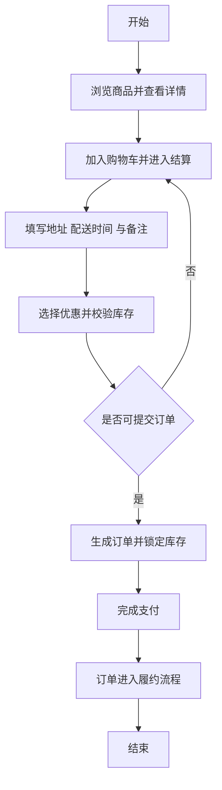

原来的文章是pdf，我使用MinerU将pdf转换成了md

1. 论文格式模版供参考
thesis/reference-materials/论文格式模版供参考/论文格式模版供参考.md

2. 往届生参考论文
thesis/reference-materials/往届生论文3篇/1-2041118_蛋糕店销售系统的设计与实现.md
thesis/reference-materials/往届生论文3篇/2-节日用品销售网站的设计与实现.md
thesis/reference-materials/往届生论文3篇/3-2024XXXXXX销售网站的设计与实现.md

3. 自己的开题报告
thesis/reference-materials/自己的开题报告/2241330_祝小雨_开题报告.md

修改thesis/lunwen.md

1. 英文ABSTRACT中的Keywords翻译的太繁琐，简化一下
2. "4.2 系统功能流程设计"涉及的流程图重新画一下，类似

这样，图要有开始结束，整体图不要过于复杂
3. 每个引用的图或表都要介绍清楚，结尾总结清楚
    - 放图的同时上面要有总结，比如如图4.1不然光放个图在那里，不知道做什么的，所有涉及图的都要有介绍总结
    - 表格最后要一个简单的总结，比如4.3.2表上面得写点啥然后引出表4-1、4-2、4-3、4-4、4-5
4. “如…所示”结尾的符号（。：等）要统一
5. 结尾参考文献页英文全部要放到最后，参考文献格式完全按照学校模板（缺啥可以自己编，学校不细看），参考文献近三年，不要年份太近的
6. 对于文章中体现参考文献引用，考文献分别引用到第一、二章中，并且引用的时候不要一句话说是好几个文献引用，引用时，必须是顺序的1234...
7. 表格中没有长度的，可以换个表达，或者给个长度
8. 摘要的字数太多了 得缩到280-300 
9. 第四章的功能结构图与第三章需求分析保持一致。

